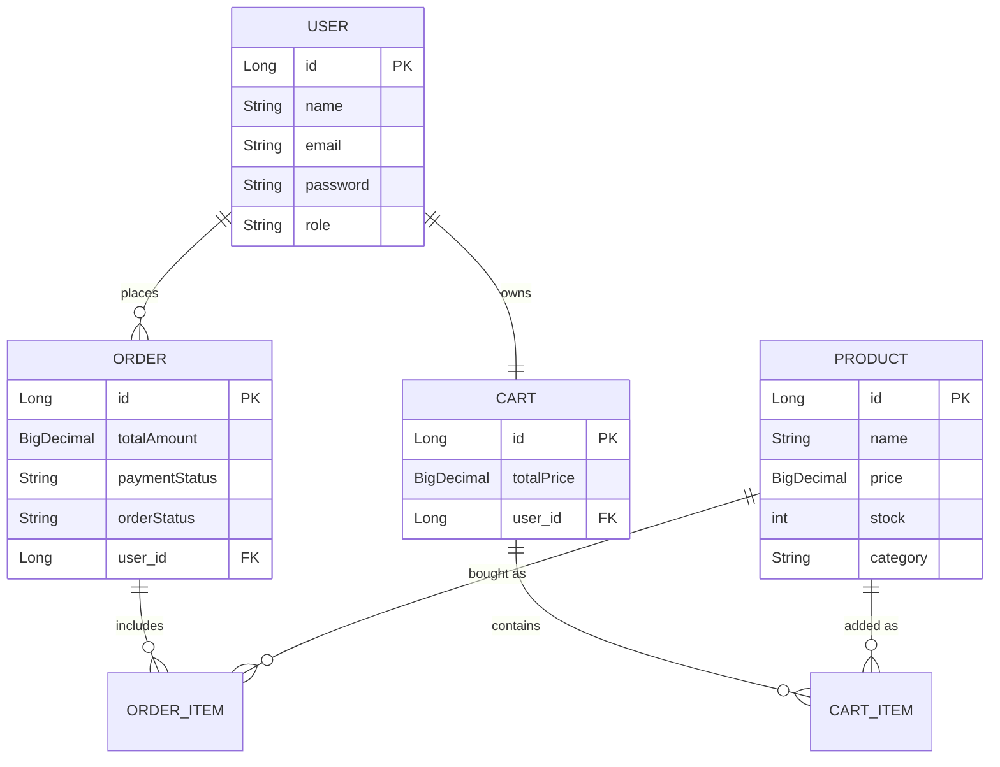

# E-Commerce Backend API

**Created and designed by:** Swastideepa Dash

## Project Overview
This is a robust, production-ready E-commerce REST API built with Spring Boot. It features secure user authentication, product management, a functional shopping cart, simulated order checkout, and automated email notifications.

## Technologies Used
* **Java 17** & **Spring Boot 3**
* **Spring Security** & **JWT (JSON Web Tokens)** for authentication
* **Spring Data JPA** & **Hibernate** for database interactions
* **MySQL** (Relational Database)
* **ModelMapper** (DTO conversion) & **Spring Mail** (Email receipts)
* **JUnit 5** & **Mockito** (Unit Testing)
* **Swagger UI / OpenAPI** (API Documentation)
* **Docker & Docker Compose** (Containerization)

## Entity Relationship (ER) Diagram
*The database architecture representing how entities are related.*

## API Endpoints & Methods

| Method | Endpoint | Description | Security |
|--------|----------|-------------|----------|
| **Users** | | | |
| `POST` | `/api/users/register` | Register a new user account | Public |
| `POST` | `/api/users/login` | Authenticate and generate JWT token | Public |
| `PUT` | `/api/users/profile` | Update logged-in user profile | Secured (JWT) |
| `PUT` | `/api/users/change-password` | Change password for logged-in user | Secured (JWT) |
| `GET` | `/api/users/{id}` | Retrieve a user by ID | Secured (Admin) |
| `PUT` | `/api/users/{id}` | Update a user by ID | Secured (Admin) |
| `DELETE`| `/api/users/{id}` | Delete a user by ID | Secured (Admin) |
| **Products** | | | |
| `POST` | `/api/products` | Add a new product to the catalog | Secured (Admin) |
| `GET`  | `/api/products` | Retrieve all products (Supports Pagination & Filters) | Public |
| `PUT` | `/api/products/{id}` | Update an existing product | Secured (Admin) |
| `DELETE`| `/api/products/{id}` | Delete a product from the catalog | Secured (Admin) |
| **Cart** | | | |
| `GET` | `/api/cart` | View the current user's active cart | Secured (JWT) |
| `POST` | `/api/cart/add/{productId}?quantity={qty}` | Add product to active shopping cart | Secured (JWT) |
| `PUT` | `/api/cart/update/{productId}?quantity={qty}`| Update item quantity in cart | Secured (JWT) |
| `DELETE`| `/api/cart/remove/{productId}` | Remove an item entirely from the cart | Secured (JWT) |
| **Orders** | | | |
| `POST` | `/api/orders/checkout` | Process payment and place order | Secured (JWT) |

## API Screenshots

